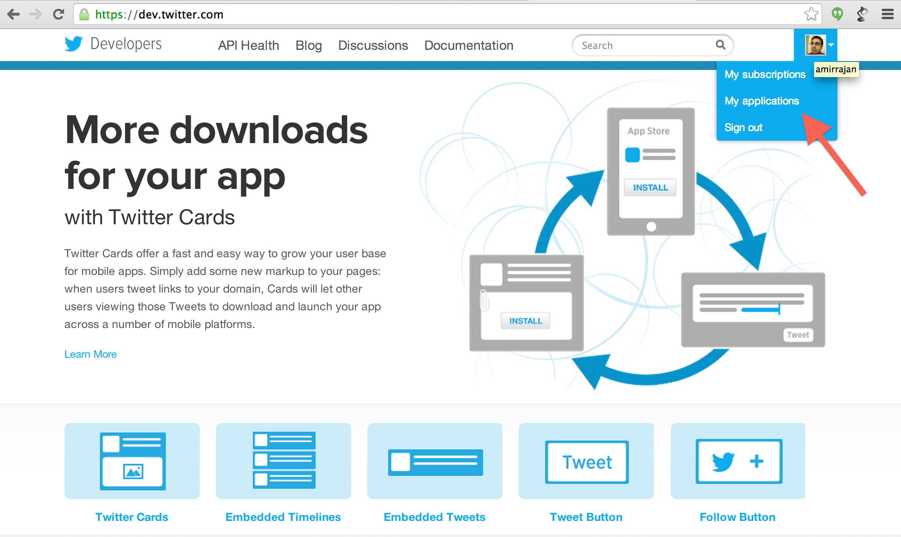
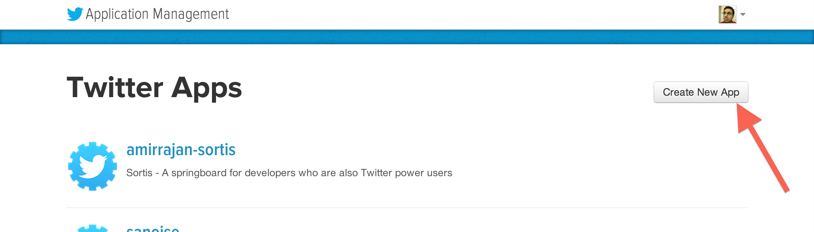
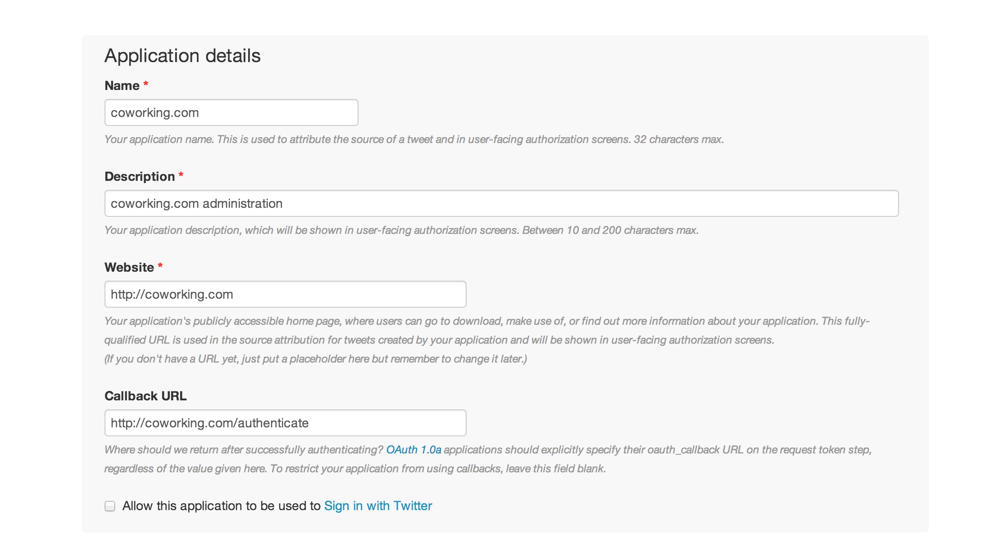

## coworking.com - A world wide registry for cowork locations.

The idea is simple: independent professionals and those with workplace flexibility work better together than they do alone. Coworking spaces are about community-building and sustainability. Participants agree to uphold the values set forth by the movement’s founders, as well as interact and share with one another. We are about creating better places to work and as a result, a better way to work.

Tech: NodeJS, AngularJS, ExpressJS, Redis, Twitter Rest Api's

License: MIT

## Instructions for deploying your own instance of coworking.com

These instructions are meant for a technical audience.

Go to http://nodejs.org and install NodeJS

Go to http://redis.io/download and install Redis

Then clone this repo:

    git clone https://github.com/amirrajan/coworkingdotcom.git

And `cd` into the directory (all instructions below assume you are in the `coworkingdotcom` directory:

    cd coworkingdotcom

## Run Locally

Using a command prompt where `node` is available, run the following command to install all Sortis dependencies:

    npm install (you may need to prefix this with sudo if you're on Mac/Linux)
    bower install (you may need to prefix this with sudo if you're on Mac/Linux)

Register for a Twitter developer account: https://dev.twitter.com/user/login?destination=home

Under My Applications (https://dev.twitter.com/apps), create a new application:

Set up the application with the following settings. Anywhere you see coworking.com, replace that with your url:

*Note: "Allow this application to be used to Sign in with Twitter" should be **unchecked**.*

Set up a Google Maps Api Key.

1. Go to the Google Api Console: https://code.google.com/apis/console/
2. Login to your Google account.
3. Click services on the left hand navigation bar.
4. Enable Google Maps JavaScript API v3.
5. Click API Access on the left hand navigation bar.
6. Click Create new Browser key (you can limit referrers if needed).

Once your Twitter account, and Google API key set up. You can test the site locally.

Create a `.env` file and set the following values:

    cookieSecret=XXXXXXXXXXXXX
    twitterConsumerKey=XXXXXXXXXXXXXXXXXXXXXXXXX
    twitterConsumerSecret=XXXXXXXXXXXXXXXXXXXXXXXXXXXXXXXXXXXXXXXXXXXXXXXXXX
    twitterCallbackUrl=http://coworking.dev:3000/authenticate
    googleMapsApiKey=XXXXXXXXXXXXXXXXXXXXXXXXXXXXXXXXXXXXXXX
    PORT=3000

Add the following line to `/etc/hosts`

    127.0.0.1 coworking.dev

Run the app:

    grunt

To view the app, go to `http://coworking.dev:3000`.

##Deploying to Heroku

From heroku.com, click Documentation, then click the Getting Started button, then click Node.js from the list of options on the left...which will take you here: https://devcenter.heroku.com/articles/nodejs 

Install Heroku toolbelt from here: https://toolbelt.heroku.com/

Login using the command line tool:

    heroku login

Create your heroku app:

    heroku create YOURAPPNAME

Add redis to your app

    heroku addons:add redistogo:nano

Git deploy your app:

    git push heroku master

Assign a dyno to your app:

    heroku ps:scale web=1

Set environment variables on the server:

    heroku config:set cookieSecret=XXXXXXXXXXXXX
    heroku config:set twitterConsumerKey=XXXXXXXXXXXXXXXXXXXXXXXXX
    heroku config:set twitterConsumerSecret=XXXXXXXXXXXXXXXXXXXXXXXXXXXXXXXXXXXXXXXXXXXXXXXXXX
    heroku config:set twitterCallbackUrl=http://XXXXXXXXX.com/authenticate
    heroku config:set googleMapsApiKey=XXXXXXXXXXXXXXXXXXXXXXXXXXXXXXXXXXXXXXX
    heroku config:set PORT=80

Open the app (same as opening it in the browser):

    heroku open

And your app should be up on Heroku.
